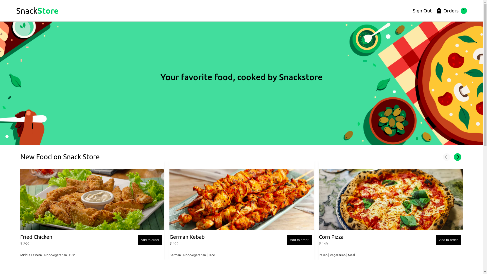

# Snackstore

Snackstore is a food-ordering application it has all the functionalities which a normal e-ecommerce store has like user-authentication, food-listings, real-time cart component and a Beautiful User-Interface

Check out the live demo: https://movietrova.netlify.app/

## How to run the project?

1. Clone this repository in your local system.
2. Open the command prompt from your project directory and run the command `npm install && npm start`.
3. Go to your browser and type `http://127.0.0.1:3000/` in the address bar.
4. Hurray! That's it.

**Note - You need your own firebase configuration file in order to run this app locally**
